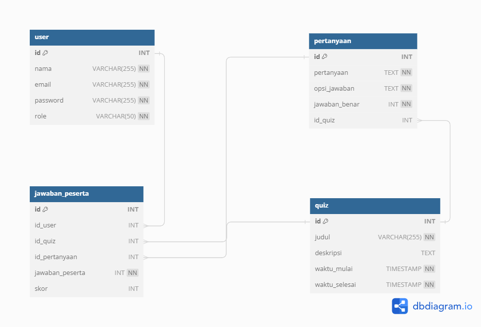

# Backend sederhana aplikasi quiz online
Saya menggunakan framework fiber, database mysql, orm gorm.

## Beberapa catatan yang mungkin berbeda
- Pada tabel pertanyaan, pada kolom jawaban_benar saya menggunakan indeks dari 1. Artinya misal terdapat opsi jawaban "6\`-\`42\`-\`30\`-\`25\`-\`36", kemudian jawaban_benar:2, berarti pilihan ke dua, yaitu 42 adalah jawaban yang benar
- Saya terlanjur menggunakan pemisah seperti ini(yang tampak pada thunder client), "6\`-\`42\`-\`30\`-\`25\`-\`36", namun untuk aplikasi ini tidak terlalu berpengaruh
- Saya membuat endpoint dimana admin memeriksa peserta dengan suatu id dan quiz dengan suatu id secara langsung, mengisi kolom skor untuk setiap row pada tabel jawaban peserta, dan juga menghitung total nilai ((jawaban benar)/jumlah soal) x 100. Hasil responsenya adalah jawaban peserta untuk setiap pertanyaan, yang sudah diupdate nilai skornya, beserta field nilai yang merupakan nilai keseluruhan
- Saya membuat endpoint untuk register admin, namun saya mencobanya dulu dengan tidak menerapkan autentikasi jwt, untuk membuat admin pertama.. Berikut record dari tabel user yang saya gunakan, dalam format csv dan sql command, berada pada file dataTabel
- Terdapat dua role dari user, yaitu admin dan user.

## struktur folder
- folder controllers berisi controller dari endpoint route
- folder route, berisi 1 file, yang mengatur routing dari aplikasi ini
- folder middleware berisi middleware yang digunakan
- folder database berisi logic untuk koneksi ke database
- folder models berisi struct seperti representasi tabel, yang digunakan gorm 

## Cara menjalakan project
- Mengisi file .env
- Membuat database sesuai dengan yang ditulis pada .env
- Menambah admin, melalui sql command atau csv yang berada pada folder dataTabel
- `go run main.go`

## Tabel pada database

  

Pada project ini saya tidak melakukan migrasi database. Saya hanya run `source init.sql` dan membuat struct model yang tipe datanya sesuai, untuk nanti digunakan paket gorm. 

## Route yang ada
Terdapat 4 grup route yang ada, yaitu mengenai autentikasi, CRUD pada tabel quiz, CRUD pada tabel pertanyaan, CRUD pada tabel jawaban peserta. Terdapat 2 middleware pada project, yaitu middleware untuk JWT dan middleware untuk mencatat request masuk. 
- Middleware JWT diterapkan pada grup route mengenai CRUD pada tabel quiz, sehingga request perlu authorization header, untuk bearer token. Hanya user dengan role admin yang bisa mengakses
- Middleware JWT diterapkan pada grup route mengenai CRUD pada tabel pertanyaan, sehingga request perlu authorization header, untuk bearer token. . Hanya user dengan role user yang bisa mengakses

## Path Operation
Saya menyertakan export dari request pada thunder client yang saya gunakan.
Secara umum, pada endpoint yang menerima body request, saya melakukan validasi, saat parsing body request, dan akan mengirim balik bad request jika terdapat kesalahan. Saya juga mengecek apakah resource yang ingin digunakan ada. Misalkan ingin menambah pertanyaan pada suatu quiz, saya mengecek terlebih dahulu apakah quiz tersebut ada. Terdapat beberapa endpoint dimana terdapat authorization, seperti hanya user admin yang boleh melakukan operasi CRUD pada tabel pertanyaan dan jawaban.

- CRUD pada tabel pertanyaan
    - GET /quiz/:idQuiz/pertanyaan  -> Mendapat semua pertanyaan pada quiz dengan id idQuiz
    - GET /quiz/:idQuiz/pertanyaan/:idPertanyaan -> Mendapat pertanyaan dengan id idPertanyaan, yang berada di quiz dengan id idQuiz
    - POST /quiz/:idQuiz/pertanyaan/ -> Menambah pertanyaan pada quiz dengan id idQuiz
    - PATCH /quiz/:idQuiz/pertanyaan/:idPertanyaan -> Mengedit sebagian data dari pertanyaan dengan id idPertanyaan, yang terletak pada quiz idQuiz
    - DELETE /quiz/:idQuiz/pertanyaan/:idPertanyaan -> Menghapus pertanyaan dengan idPertanyaan pada quiz dengan idQuiz

- CRUD pada tabel quiz
    - GET /quiz/:idQuiz  -> Mendapat quiz dengan id idQuiz
    - GET /quiz -> Mendapat semua quiz
    - POST /quiz -> Menambah quiz
    - PATCH /quiz/:idQuiz -> Mengedit sebagian data dari quiz dengan id idQuiz
    - DELETE /quiz/:idQuiz -> Menghapus quiz dengan idQuiz

- CRUD pada tabel jawaban peserta
    - GET /jawaban  -> Mendapat semua record dari jawaban
    - GET /jawaban/:idJawaban -> Mendapat semua jawaban dengan id idJawaban
    - POST /jawaban -> Menambah jawaban
    - PATCH /jawaban/:idJawaban -> Mengedit sebagian data dari jawaban dengan idJawaban
    - DELETE /jawaban/:idJawaban -> Menghapus jawaban dengan idJawaban

- Autentikasi
    - POST /login -> login user
    - POST /register -> untuk regster, role user
    - POST /register_admin -> untuk regster admin, hanya bisa dilakukan oleh user dengan role admin

- Memeriksa jawaban peserta 
    - api/v1/periksa

